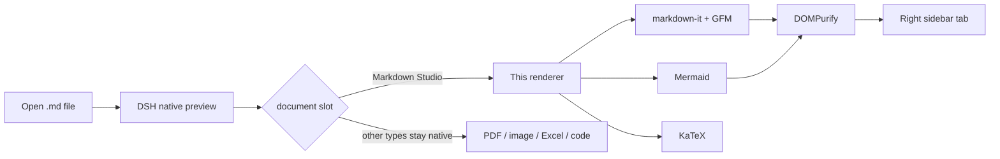

<div align="center">

# 📄 Markdown Studio for DeepSeek Harness

**Mermaid diagrams, math formulas and syntax highlighting rendered right inside DSH's native right-sidebar file preview.**

The rendering engine ships with the plugin — **fully offline** · no document changes needed · disable to restore the stock renderer

[](https://github.com/BioAIEvolu/dsh-md-studio/actions/workflows/ci.yml)
[](https://www.npmjs.com/package/dsh-md-studio)
[](https://github.com/BioAIEvolu/dsh-md-studio/releases)
[](LICENSE)
[](https://github.com/deepseek-ai/deepseek-harness)
[](README.md)

[The same Mermaid block: stock preview vs Markdown Studio](docs/images/before-after.png)

</div>

---

## Why

DeepSeek Harness's right-sidebar preview is great — except ` ```mermaid ` blocks show up as raw code. Existing workarounds open a separate panel or fetch rendering engines from a CDN.

**Markdown Studio takes over the native preview's Markdown renderer**: file reads, permission checks, reload and tab lifecycle all stay native — only the drawing is upgraded. Mermaid, markdown-it, KaTeX, highlight.js and DOMPurify ship **inside the bundle**, so diagrams work offline.

| Stock preview | Markdown Studio |
|---|---|
| `​```mermaid` shown as code | Rendered in place as SVG + toolbar |

## ✨ Features

- **📈 Mermaid diagrams** — flowcharts, sequence, gantt, pie and the full Mermaid 11 family; per-diagram toolbar with **diagram/source toggle · fullscreen (zoom & pan) · SVG download**; automatic re-render on theme change
- **🩹 Syntax auto-repair** — the most common real-world breaker, ASCII parentheses inside node labels (`W2[Codex / Claude Code (ACP)]`), is repaired and rendered with an "auto-repaired" badge. No need to edit your documents
- **📐 KaTeX math** — inline `$...$` and display `$$...$$`
- **📝 Full GFM** — tables, task lists, footnotes, heading anchors
- **🎨 Syntax highlighting** — highlight.js common languages
- **🖼️ Local images** — relative paths resolve beside the document through DSH's authenticated file route
- **📴 Fully offline** — zero rendering network requests (asserted by automated tests); remote images authored in the document still load from their URLs
- **🛡️ Secure** — DOMPurify sanitization for both document HTML and diagram SVG; scripts never execute; Mermaid runs in `strict` mode

## 📸 Screenshots

| Dark | Light |
|---|---|
|  |  |

## 🚀 Install

> Requires DeepSeek Harness `0.2.0-rc.2+` (client slot API, see [Compatibility](#️-compatibility))

**Option 1 · In-app plugin market (dshmarket)** — search `dsh-md-studio`.

**Option 2 · CLI from GitHub**
```sh
dsh plugin --profile desktop add github:BioAIEvolu/dsh-md-studio
```

**Option 3 · CLI from npm (once published)**
```sh
dsh plugin --profile desktop add dsh-md-studio
```

Restart DSH Desktop, then open any `.md` file in the right sidebar.

## 📖 Usage

- A **Markdown Studio** marker and a **source toggle** appear above the document
- Every Mermaid diagram gets its own toolbar: **diagram / source / fullscreen / download SVG**
- Fullscreen supports wheel zoom, drag pan and fit
- A broken diagram keeps its source plus the reason — other diagrams still render
- Disable the plugin anytime to restore the stock renderer

Try [docs/demo.md](docs/demo.md) — a document covering every feature.

## 🧠 How it works

No DOM scanning, no floating panel: the plugin registers on DSH's **official document-preview slot** and takes over the official Markdown key with higher priority.



File reading, paging, reload and lifecycle remain DSH's job — the plugin only draws. Slot takeover is verified live via DSH Inspect: this plugin `active: true`, the official Markdown occupant yields.

## ✅ Quality

`node test/browser.mjs` loads the exact shipped bundle in a real Chromium with networking blocked (asserts **zero network requests, zero page errors**): 4 diagram types with visible labels, auto-repair, GFM, math, highlighting, toggles, fullscreen, SVG download, theme re-render, broken-diagram isolation, XSS sanitization, rapid file switching and disposal. Full list in the [Chinese README](README.md#-质量保障).

## ⚠️ Compatibility

- Built for **DSH `0.2.0-rc.2`** (`engines.dsh: >=0.2.0-rc.2 <0.3.0-0`); other versions unverified — open an issue if the slot API changes
- Limits: 2M chars per document, 50k chars / 2000 lines / 2000 edges per diagram
- Sanitized Mermaid output: diagram interactions and external references are disabled

## 🛠️ Build from source

```sh
pnpm install --ignore-scripts
node scripts/build.mjs        # lib/ incl. fonts and license notices
node test/browser.mjs
node test/screenshots.mjs     # regenerate docs images
pnpm pack
```

`lib/client.js` is shipped in DSH ModuleLoader factory format; only React is required from the host.

## 🙏 Credits

- [dsh-mermaid](https://github.com/MrmoLabs/dsh-mermaid) and [dsh-artifact-preview](https://github.com/nirvanaslash/dsh-artifact-preview) — inspiration for the interaction design
- Libraries: [Mermaid](https://mermaid.js.org/) · [markdown-it](https://github.com/markdown-it/markdown-it) · [DOMPurify](https://github.com/cure53/DOMPurify) · [highlight.js](https://highlightjs.org/) · [KaTeX](https://katex.org/) — full notices in [THIRD_PARTY_NOTICES.md](THIRD_PARTY_NOTICES.md)

## ⭐ Support

If this plugin saves you time, please star the repo. Issues and PRs welcome — [中文文档](README.md).

## License

[MIT](LICENSE) © BioAIEvolu
