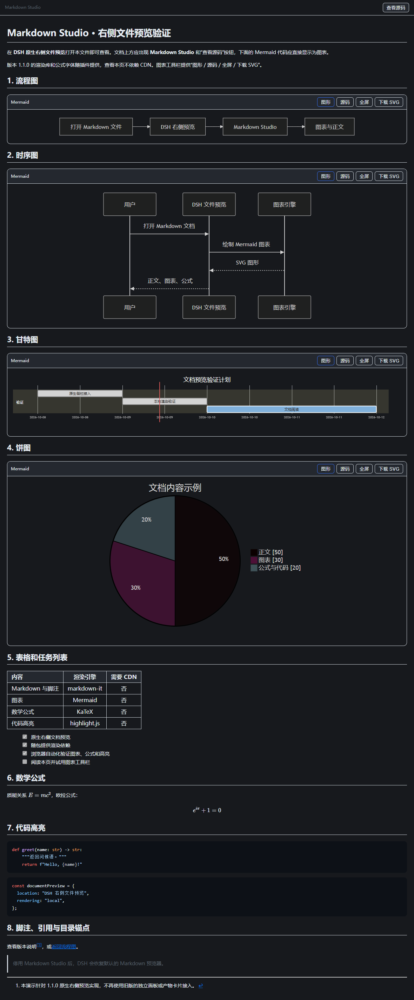
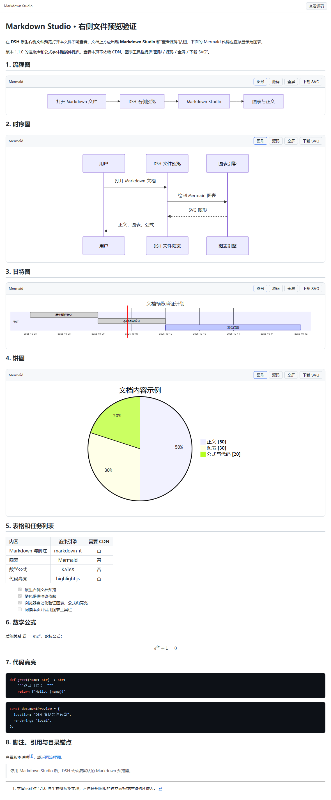
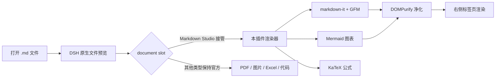

<div align="center">

# 📄 Markdown Studio for DeepSeek Harness

**在 DSH 原生右侧文件预览中，把 Markdown 里的 Mermaid 图表、数学公式、代码高亮一次看全。**

渲染引擎随插件内置，**完全离线可用** · 无需改动你的文档 · 停用即恢复官方渲染器

[](https://github.com/BioAIEvolu/dsh-md-studio/actions/workflows/ci.yml)
[](https://github.com/BioAIEvolu/dsh-md-studio/releases)
[](LICENSE)
[](https://github.com/deepseek-ai/deepseek-harness)
[](README.en.md)

[同一份 Mermaid 代码块：官方预览 vs Markdown Studio](docs/images/before-after.png)

</div>

---

## 为什么需要它

DeepSeek Harness 的右侧文件预览很好用，但 **Mermaid 代码块只会显示为一堆源码**——架构图、时序图、流程图全都要靠想象。外部方案要么需要开独立面板、要么依赖 CDN 联网。

**Markdown Studio 直接接管原生预览的 Markdown 渲染器**：文件读取、权限校验、刷新、标签页这些全部保留 DSH 原生行为，只有"画"的部分被增强。渲染引擎（Mermaid / markdown-it / KaTeX / highlight.js / DOMPurify）**随插件打包**，断网也能看图。

| 官方预览 | Markdown Studio |
|---|---|
| `​```mermaid` 显示为代码块 | 就地渲染为 SVG 图 + 工具栏 |
| 长文档来回滚动 | 图文混排，所见即所得 |

## ✨ 特性

- **📈 Mermaid 图表**：流程图、时序图、甘特图、饼图等 Mermaid 11 全系图型；每张图带 **图形/源码切换 · 全屏（缩放/拖拽）· 下载 SVG** 工具栏；深浅主题自动重绘
- **🩹 语法自动修复**：真实文档里最常见的 `W2[Codex / Claude Code (ACP)]` 这类"标签含英文括号"语法错误，**自动修复后照常渲染**，并在徽章标注"已自动修复"——不用改你的文档
- **📐 KaTeX 数学公式**：行内 `$...$` 与块级 `$$...$$`
- **📝 完整 GFM**：表格、任务列表、脚注、删除线、标题锚点跳转
- **🎨 代码高亮**：highlight.js 常用语言集
- **🖼️ 本地图片**：相对路径按文档目录解析，经 DSH 原生鉴权接口读取
- **📴 完全离线**：渲染零网络请求（有自动化测试断言兜底）；作者写在文档里的远程图片仍按原 URL 加载
- **🛡️ 安全**：DOMPurify 双重净化（文档 HTML + 图表 SVG），禁执行脚本；Mermaid `strict` 模式

## 📸 截图

| 深色主题 | |
|---|---|
|  |  |
| 深色 | 浅色 |

## 🚀 安装

> 需要 DeepSeek Harness `0.2.0-rc.2+`（客户端插槽 API 依赖，见 [兼容性](#️-兼容性)）

**方式一 · 可视化插件市场（dshmarket）**
在 DSH 设置 → 插件 → 市场中搜索 `dsh-md-studio`。

**方式二 · 命令行（GitHub）**
```sh
dsh plugin --profile desktop add github:BioAIEvolu/dsh-md-studio
```

**方式三 · 命令行（npm，发布后可用）**
```sh
dsh plugin --profile desktop add dsh-md-studio
```

安装后重启 DSH Desktop，在右侧打开任意 `.md` 文件即可。

## 📖 使用

打开 Markdown 文件后：

- 文档顶部出现 **Markdown Studio** 标识与 **查看源码** 按钮（整篇源码/渲染视图切换）
- 每个 Mermaid 图表自带工具栏：**图形 / 源码 / 全屏 / 下载 SVG**
- 全屏模式支持滚轮缩放、拖拽平移、一键适应
- 语法错误的图表保留源码并给出原因，**不影响文档里其他图表**
- 不想用了？在插件管理中停用，官方渲染器原样恢复

试试仓库里的 [docs/demo.md](docs/demo.md)——一份覆盖全部特性的验证文档。

## 🧠 工作原理

不扫描页面 DOM、不开独立窗口，而是注册 DSH 文档预览的**官方扩展插槽**，以更高优先级接管官方 Markdown 渲染键：



- 文件读取、分页、刷新、生命周期仍由 DSH 管理——插件只负责"画"
- 通过实时 Inspect 验证插槽注册：本插件 `active: true`，官方 Markdown 渲染器自动让位

## ✅ 质量保障

`node test/browser.mjs` 加载与发布完全一致的 bundle，在真实 Chromium 中断网验证（**零网络请求、零页面异常** 断言）：

| 验证项 | |
|---|---|
| Mermaid 四类图渲染 + 节点文字可见 | ✅ |
| 含括号标签自动修复 | ✅ |
| GFM 表格 / 任务列表 / 脚注 | ✅ |
| 行内 + 块级 KaTeX | ✅ |
| 代码高亮 | ✅ |
| 图形/源码切换、全屏、SVG 下载 | ✅ |
| 深浅主题重绘 | ✅ |
| 非法图表隔离（一图坏不拖累整页） | ✅ |
| XSS 净化（脚本不执行） | ✅ |
| 快速切换文件无陈旧渲染 | ✅ |
| 卸载清理 | ✅ |

## ⚠️ 兼容性

- 适配 **DSH `0.2.0-rc.2`**（`engines.dsh: >=0.2.0-rc.2 <0.3.0-0`）；其他版本未验证，升级 DSH 后如插槽 API 变更请提 issue
- 文档上限 200 万字符；单图 5 万字符 / 2000 行 / 2000 边
- Mermaid 输出经净化：图表内的交互点击、外部图片引用会被禁用

## 🛠️ 从源码构建

```sh
pnpm install --ignore-scripts
node scripts/build.mjs        # 产出 lib/（含字体与三方授权清单）
node test/browser.mjs         # 真实浏览器测试
node test/screenshots.mjs     # 重新生成文档截图
pnpm pack                     # 打包 dsh-md-studio-x.y.z.tgz
```

构建产物 `lib/client.js` 为 DSH ModuleLoader 工厂格式，仅依赖宿主 React，其余依赖全部打包。

## 🗺️ Roadmap

- [ ] 对话内 Mermaid 渲染（与 [dsh-mermaid](https://github.com/MrmoLabs/dsh-mermaid) 互补）
- [ ] 图表导出 PNG
- [ ] 目录（TOC）侧栏
- [ ] 设置页（字号、图表方向）

## 🙏 致谢

- [dsh-mermaid](https://github.com/MrmoLabs/dsh-mermaid)（MrmoLabs）与 [dsh-artifact-preview](https://github.com/nirvanaslash/dsh-artifact-preview)（nirvanaslash）——1.0 版的整合来源，1.1 的交互设计参考
- 渲染库：[Mermaid](https://mermaid.js.org/) · [markdown-it](https://github.com/markdown-it/markdown-it) · [DOMPurify](https://github.com/cure53/DOMPurify) · [highlight.js](https://highlightjs.org/) · [KaTeX](https://katex.org/)，完整授权见 [THIRD_PARTY_NOTICES.md](THIRD_PARTY_NOTICES.md)

## ⭐ 支持项目

如果这个插件帮你省掉了"改文档语法"和"切窗口看图"的时间，欢迎点个 Star；问题与需求请提 [Issue](https://github.com/BioAIEvolu/dsh-md-studio/issues)，PR 欢迎。

English documentation: [README.en.md](README.en.md)

## License

[MIT](LICENSE) © BioAIEvolu
