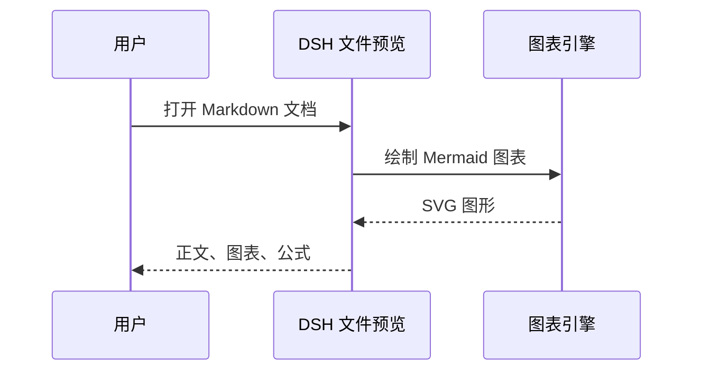
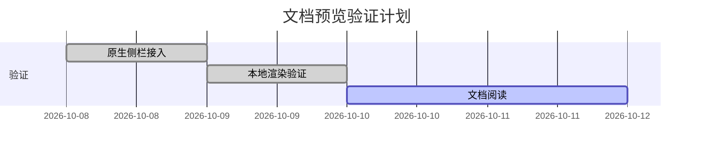
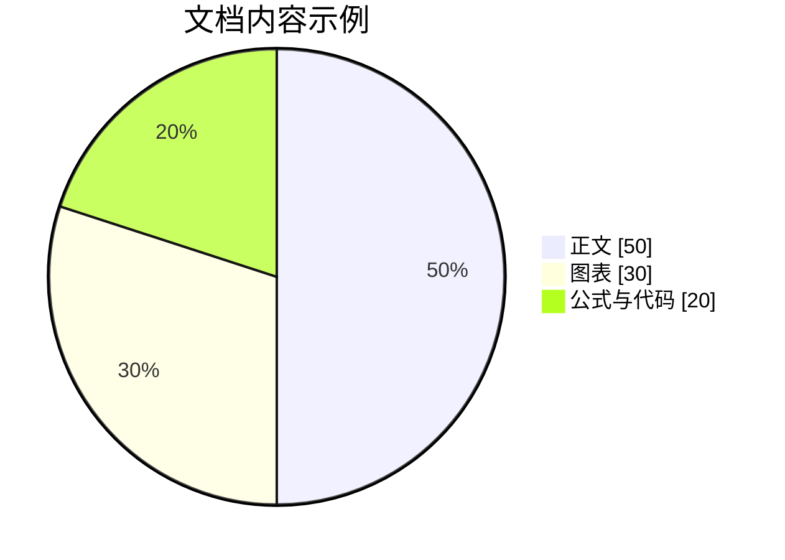

# Markdown Studio · 右侧文件预览验证

在 **DSH 原生右侧文件预览**打开本文件即可查看。文档上方应出现 **Markdown Studio** 和“查看源码”按钮，下面的 Mermaid 代码应直接显示为图表。

版本 1.1.0 的渲染库和公式字体随插件提供，查看本页不依赖 CDN。图表工具栏提供“图形 / 源码 / 全屏 / 下载 SVG”。

## 1. 流程图


## 2. 时序图



## 3. 甘特图



## 4. 饼图



## 5. 表格和任务列表

| 内容 | 渲染引擎 | 需要 CDN |
|:-----|:--------:|:--------:|
| Markdown 与脚注 | markdown-it | 否 |
| 图表 | Mermaid | 否 |
| 数学公式 | KaTeX | 否 |
| 代码高亮 | highlight.js | 否 |

- [x] 原生右侧文档预览
- [x] 随包提供渲染依赖
- [x] 浏览器自动化验证图表、公式和高亮
- [ ] 阅读本页并试用图表工具栏

## 6. 数学公式

质能关系 $E = mc^2$，欧拉公式：

$$
e^{i\pi} + 1 = 0
$$

## 7. 代码高亮

```python
def greet(name: str) -> str:
    """返回问候语。"""
    return f"Hello, {name}!"
```

```js
const documentPreview = {
  location: "DSH 右侧文件预览",
  rendering: "local",
};
```

## 8. 脚注、引用与目录锚点

查看版本说明[^version]，或[返回流程图](#1-流程图)。

> 停用 Markdown Studio 后，DSH 会恢复默认的 Markdown 预览器。

[^version]: 本演示针对 1.1.0 原生右侧预览实现，不再使用旧版的独立面板或产物卡片接入。
